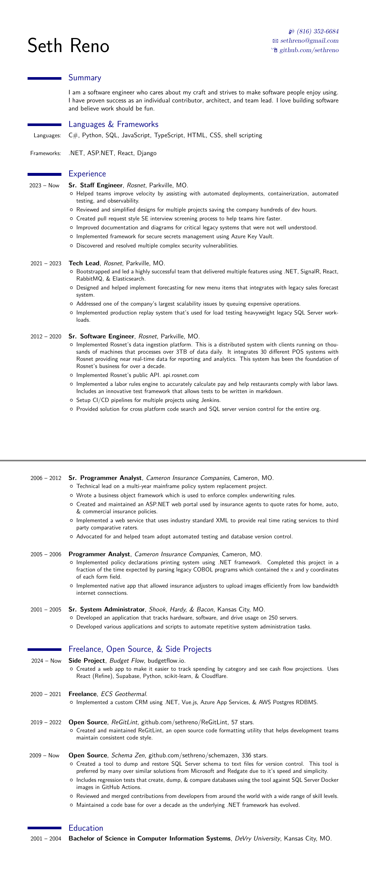

Click [here](output/resume.pdf) to download the pdf version.

## Compiling
The source for this resume is written with LaTeX. It can be compiled to pdf &
png using `xelatex` and `pdftoppm`. The repo includes a docker image & dev
container that can be used to compile the resume without installing these tools
on the host.

1. Launch Visual Studio Code
2. Open the repo in the included Dev Container
   Ctrl+Shift+P --> Dev Containers: Open Folder in Container...
3. Open a terminal in vscode. Ctrl+` and run the following commands:

   ```bash
    pushd src && xelatex resume.tex && mv resume.pdf ../output && popd
    pdftoppm -png output/resume.pdf > output/resume.png
    ```
